# 🌱 GreenChain — Carbon MRV & Credit Marketplace for Smallholder Agriculture

**GreenChain** is a mobile-first carbon-credit **Measurement, Reporting and Verification (MRV)** platform designed for smallholder agriculture.

It connects farmers, Farmer Producer Organizations (FPOs), verifiers, buyers, and administrators through a single workflow covering **farm onboarding, crop-cycle monitoring, evidence collection, carbon estimation, verification, credit issuance, marketplace transactions, and retirement**.

Built with **React Native, FastAPI, PostgreSQL, GIS services, and Polygon Amoy**, GreenChain explores how digital MRV and blockchain-backed auditability can make agricultural carbon-credit workflows more transparent and accessible.

---

## 🌍 The Problem

Smallholder farmers can contribute to climate mitigation through improved agricultural practices, but participation in carbon markets can be difficult.

A carbon-credit system must answer several questions:

- Where is the farm?
- What agricultural practice was followed?
- What environmental observations support the claim?
- How was the carbon impact calculated?
- Has supporting evidence been verified?
- Who owns the resulting credits?
- Have those credits already been listed, sold, or retired?
- Can the lifecycle be audited later?

GreenChain approaches this as an end-to-end digital workflow rather than treating carbon calculation, verification, and trading as separate systems.

---

# 🔄 Carbon Credit Lifecycle

```text
Farm Registration
        ↓
Crop Cycle
        ↓
Observations & Evidence
        ↓
Carbon / SOC Analysis
        ↓
MRV Evaluation
        ↓
Verifier Review
        ↓
Credit Approval
        ↓
Token Minting
        ↓
Marketplace Listing
        ↓
Buyer Order
        ↓
Payment
        ↓
Farmer / FPO Settlement
        ↓
Credit Retirement
        ↓
Retirement Certificate
```

The platform therefore manages both the **environmental evidence lifecycle** and the **commercial credit lifecycle**.

---

# ✨ Core Capabilities

## 🚜 Farm & Crop-Cycle Management

Farmers can register farms and manage agricultural activity through crop cycles.

Farm records form the geographic and operational foundation for:

- Observations
- Evidence
- Carbon reports
- Verification
- Credit generation

GIS-aware farm information allows environmental observations to be associated with specific agricultural locations.

---

## 📊 Digital MRV

GreenChain implements a digital **Measurement, Reporting and Verification** workflow.

### Measurement

Environmental and agricultural observations provide data associated with a farm and crop cycle.

### Reporting

The system converts observations and supporting information into structured carbon reports.

### Verification

Reports and evidence are evaluated before credits can progress through the carbon lifecycle.

The MRV layer includes:

- Carbon calculations
- Soil Organic Carbon analysis
- Evidence processing
- Risk assessment
- Verification workflows
- Recommendation generation

---

# 🌱 Soil Organic Carbon

GreenChain includes a dedicated **Soil Organic Carbon (SOC)** service and calculation engine.

```text
Farm / Observation Data
          ↓
      SOC Service
          ↓
       SOC Engine
          ↓
  SOC Estimate / Result
          ↓
      PostgreSQL
```

Separating SOC calculations into their own service makes the carbon-analysis layer easier to extend as methodologies evolve.

---

# 📸 Evidence Integrity

Environmental claims require evidence that can later be verified.

GreenChain supports evidence submission and creates a **SHA-256 hash** for uploaded evidence.

```text
Evidence
   ↓
SHA-256 Hash
   ↓
Stored Evidence Record
   ↓
Verification
```

Hashing provides a digital fingerprint that can be used to detect whether evidence has changed after submission.

---

# 🛰️ GIS & Observation Layer

The observation system connects farm activity with geospatial information.

```text
Farm
  ↓
Coordinates / Boundary
  ↓
GIS Service
  ↓
GIS Provider
  ↓
Environmental Observation
```

The GIS architecture uses a provider abstraction so external imagery or geospatial providers can be introduced without tightly coupling the rest of the backend to a single provider.

The current prototype supports mock/fallback behaviour when external GIS credentials are unavailable.

---

# 🔍 Verification & Risk Assessment

Verification is separated from farmer reporting.

The verification workflow can evaluate:

- Carbon reports
- Supporting evidence
- Farm/crop information
- Risk indicators

The verification layer includes:

```text
Submitted Report
      ↓
Evidence Review
      ↓
Risk Engine
      ↓
Verifier Decision
      ↓
Recommendations / Guidance
```

Reports can then move through approval or rejection workflows before credits become eligible for subsequent processing.

---

# 🪙 Carbon Credit Management

GreenChain maintains credit state across the lifecycle.

```text
Approved Credits
       ↓
Minted Credits
       ↓
Farmer Available Balance
       ↓
Listed Credits
       ↓
Reserved Buyer Credits
       ↓
Purchased Credits
       ↓
Retired Credits
```

An important design principle is that **blockchain transaction state and application ownership state are not treated as the same thing**.

PostgreSQL maintains the operational ownership, reservation, marketplace, and payment state, while blockchain transactions provide an additional auditable settlement layer.

---

# 🛒 Carbon Credit Marketplace

Verified credits can enter the marketplace.

The marketplace supports:

- Credit listings
- Credit reservation
- Buyer orders
- Listing inventory management
- Payment-state tracking
- Credit retirement

### Preventing Double Selling

GreenChain applies reservation logic throughout the marketplace lifecycle.

```text
Farmer Credits
     ↓
Listing reserves credits
     ↓
Buyer order reserves inventory
     ↓
Payment
     ↓
Settlement / Retirement
```

PostgreSQL row locking is used in relevant transactional flows to reduce the risk of concurrent requests overselling the same available credit inventory.

Retirement requires the appropriate paid state, and duplicate retirement is blocked.

Reconciliation logic can additionally check that credit movement remains internally consistent.

---

# ⛓️ Blockchain Integration

GreenChain integrates with the **Polygon Amoy testnet**.

The blockchain layer uses an **ERC-1155 smart contract** for carbon-credit token operations.

```text
GreenChain Backend
       ↓
Blockchain Service
       ↓
     web3.py
       ↓
ERC-1155 Contract
       ↓
 Polygon Amoy
```

The current implementation follows a **custodial FPO model**.

Rather than requiring every smallholder farmer to manage a blockchain wallet directly, FPOs can manage blockchain assets on behalf of participating farmers.

This reduces wallet-management complexity while the application continues to maintain farmer-level credit ownership off-chain.

> GreenChain currently uses a testnet. Credits represented by the prototype do not represent real financial or regulated carbon assets.

---

# 👥 Role-Based Workflow

GreenChain supports five major participant roles.

| Role | Primary Responsibilities |
|---|---|
| 👨‍🌾 **Farmer** | Farms, crop cycles, evidence, carbon reports and credit balances |
| 🏢 **FPO** | Farm approval, marketplace listings, buyer orders, payment confirmation and farmer payouts |
| 🔍 **Verifier** | Carbon-report and evidence review |
| 🛒 **Buyer** | Marketplace discovery, purchase requests and credit retirement |
| 🛡️ **Admin** | Platform oversight and token-minting operations |

Role-based authorization protects backend operations so users can access only workflows appropriate to their assigned role.

---

# 🏗️ System Architecture

GreenChain is organized into five major layers:

**Mobile Experience → Backend API → MRV Intelligence → Credit Commerce → External Integrations**

```mermaid
flowchart TD

subgraph group_mobile["Mobile Experience"]
  node_mobile_app["Mobile App<br/>[App.tsx]"]
  node_api_client["API Client<br/>[client.ts]"]
  node_google_auth["Google Auth"]
end

subgraph group_api["Backend API"]
  node_fastapi["FastAPI App<br/>[main.py]"]
  node_auth_api["Auth API<br/>[auth.py]"]
  node_farm_api["Farm API<br/>[farms.py]"]
  node_observation_api["Observation APIs<br/>[satellite.py]"]
  node_evidence_api["Evidence API<br/>[evidence.py]"]
  node_carbon_api["Carbon Reports<br/>[carbon_reports.py]"]
  node_verification_api["Verification API<br/>[verification.py]"]
end

subgraph group_intelligence["MRV Intelligence"]
  node_mrv_engine["MRV Engine<br/>[mrv_engine.py]"]
  node_soc_service["SOC Service<br/>[soc_service.py]"]
  node_soc_engine["SOC Engine<br/>[soc_engine.py]"]
  node_risk_engine["Risk Engine"]
  node_recommendations["Recommendations"]
end

subgraph group_ledger["Credit Commerce"]
  node_marketplace_api["Marketplace API<br/>[marketplace.py]"]
  node_blockchain_service["Blockchain Service"]
  node_payments_api["Payments API<br/>[payments.py]"]
  node_postgres[("PostgreSQL<br/>[database.py]")]
end

subgraph group_integrations["Data Integrations"]
  node_gis_service["GIS Service<br/>[gis_service.py]"]
  node_evidence_hash["Evidence Hashing<br/>[hash_utils.py]"]
end

node_farmer(("Farmer"))
node_verifier(("Verifier"))
node_fpo(("FPO"))
node_buyer(("Buyer"))
node_admin(("Admin"))

node_google_oauth["Google OAuth"]
node_polygon["Polygon Amoy"]
node_razorpay["RazorpayX"]
node_gis_providers["GIS Providers"]

node_farmer -->|"uses"| node_mobile_app
node_verifier -->|"uses"| node_mobile_app
node_fpo -->|"uses"| node_mobile_app
node_buyer -->|"uses"| node_mobile_app
node_admin -->|"uses"| node_mobile_app

node_mobile_app -->|"makes requests"| node_api_client
node_api_client -->|"sends HTTPS"| node_fastapi

node_google_auth -.->|"authenticates"| node_google_oauth
node_google_auth -->|"posts token"| node_auth_api

node_fastapi -->|"dispatches"| node_auth_api
node_fastapi -->|"dispatches"| node_farm_api
node_fastapi -->|"dispatches"| node_observation_api
node_fastapi -->|"dispatches"| node_evidence_api
node_fastapi -->|"dispatches"| node_carbon_api
node_fastapi -->|"dispatches"| node_verification_api
node_fastapi -->|"dispatches"| node_marketplace_api
node_fastapi -->|"dispatches"| node_payments_api

node_carbon_api -->|"evaluates MRV"| node_mrv_engine
node_carbon_api -->|"calculates SOC"| node_soc_service
node_soc_service -->|"estimates SOC"| node_soc_engine
node_soc_service -->|"reads/writes"| node_postgres

node_observation_api -->|"requests scenes"| node_gis_service
node_gis_service -.->|"queries imagery"| node_gis_providers

node_evidence_api -->|"hashes files"| node_evidence_hash
node_evidence_api -->|"stores evidence"| node_postgres

node_verification_api -->|"scores risk"| node_risk_engine
node_verification_api -->|"builds guidance"| node_recommendations

node_marketplace_api -->|"reserves credits"| node_postgres

node_admin -->|"requests minting"| node_blockchain_service
node_blockchain_service -.->|"submits transactions"| node_polygon

node_payments_api -.->|"requests payout"| node_razorpay
node_payments_api -->|"records payment"| node_postgres

click node_mobile_app "https://github.com/simplyaksh18/greenchain/blob/main/mobile/App.tsx"
click node_api_client "https://github.com/simplyaksh18/greenchain/blob/main/mobile/src/api/client.ts"
click node_google_auth "https://github.com/simplyaksh18/greenchain/blob/main/mobile/src/services/googleAuthService.ts"

click node_fastapi "https://github.com/simplyaksh18/greenchain/blob/main/backend/app/main.py"
click node_auth_api "https://github.com/simplyaksh18/greenchain/blob/main/backend/app/routers/auth.py"
click node_farm_api "https://github.com/simplyaksh18/greenchain/blob/main/backend/app/routers/farms.py"
click node_observation_api "https://github.com/simplyaksh18/greenchain/blob/main/backend/app/routers/satellite.py"
click node_evidence_api "https://github.com/simplyaksh18/greenchain/blob/main/backend/app/routers/evidence.py"
click node_carbon_api "https://github.com/simplyaksh18/greenchain/blob/main/backend/app/routers/carbon_reports.py"
click node_verification_api "https://github.com/simplyaksh18/greenchain/blob/main/backend/app/routers/verification.py"

click node_mrv_engine "https://github.com/simplyaksh18/greenchain/blob/main/backend/app/services/mrv_engine.py"
click node_soc_service "https://github.com/simplyaksh18/greenchain/blob/main/backend/app/services/soc/soc_service.py"
click node_soc_engine "https://github.com/simplyaksh18/greenchain/blob/main/backend/app/services/soc/soc_engine.py"
click node_risk_engine "https://github.com/simplyaksh18/greenchain/blob/main/backend/app/services/verification_engine.py"
click node_recommendations "https://github.com/simplyaksh18/greenchain/blob/main/backend/app/services/recommendation_engine.py"

click node_gis_service "https://github.com/simplyaksh18/greenchain/blob/main/backend/app/services/gis/gis_service.py"
click node_evidence_hash "https://github.com/simplyaksh18/greenchain/blob/main/backend/app/utils/hash_utils.py"

click node_marketplace_api "https://github.com/simplyaksh18/greenchain/blob/main/backend/app/routers/marketplace.py"
click node_blockchain_service "https://github.com/simplyaksh18/greenchain/blob/main/backend/app/services/blockchain_service.py"
click node_payments_api "https://github.com/simplyaksh18/greenchain/blob/main/backend/app/routers/payments.py"
click node_postgres "https://github.com/simplyaksh18/greenchain/blob/main/backend/app/database.py"

classDef toneBlue fill:#dbeafe,stroke:#2563eb,stroke-width:1.5px,color:#172554
classDef toneAmber fill:#fef3c7,stroke:#d97706,stroke-width:1.5px,color:#78350f
classDef toneMint fill:#dcfce7,stroke:#16a34a,stroke-width:1.5px,color:#14532d
classDef toneRose fill:#ffe4e6,stroke:#e11d48,stroke-width:1.5px,color:#881337
classDef toneIndigo fill:#e0e7ff,stroke:#4f46e5,stroke-width:1.5px,color:#312e81

class node_mobile_app,node_api_client,node_google_auth toneBlue
class node_fastapi,node_auth_api,node_farm_api,node_observation_api,node_evidence_api,node_carbon_api,node_verification_api toneAmber
class node_mrv_engine,node_soc_service,node_soc_engine,node_risk_engine,node_recommendations toneMint
class node_marketplace_api,node_blockchain_service,node_payments_api,node_postgres toneRose
class node_gis_service,node_evidence_hash,node_farmer,node_verifier,node_fpo,node_buyer,node_admin,node_google_oauth,node_polygon,node_razorpay,node_gis_providers toneIndigo
```



> The Mermaid architecture is interactive on GitHub. Core components link directly to their corresponding implementation files.

---

# 🧠 Architecture Breakdown

## 1. Mobile Experience

The frontend is implemented using **React Native and Expo**.

The mobile layer handles:

- User interaction
- Role-specific workflows
- Authentication
- Location/farm interaction
- API communication
- Carbon-credit and marketplace views

The application communicates with the backend through a centralized API client.

---

## 2. FastAPI Backend

FastAPI provides the primary application API.

Requests are separated into domain-specific routers including:

```text
Authentication
Farms
Observations
Evidence
Carbon Reports
Verification
Marketplace
Payments
```

This keeps business domains separated rather than placing the entire application inside a single API layer.

---

## 3. MRV Intelligence

Carbon-related business logic is separated from HTTP routing.

The intelligence layer contains:

- MRV evaluation
- SOC estimation
- Verification/risk analysis
- Recommendation generation

This separation allows calculation methodologies to evolve independently of mobile and API code.

---

## 4. Persistence & Credit Ledger

PostgreSQL provides the authoritative application datastore for operational state.

It stores information associated with:

- Users and roles
- Farms
- Crop cycles
- Evidence
- Carbon reports
- Verification
- Credits
- Listings
- Orders
- Payments
- Retirement records

SQLAlchemy provides ORM/database access, while Alembic manages schema migrations.

---

## 5. External Integrations

GreenChain isolates third-party integrations behind dedicated service layers.

Examples include:

```text
Google OAuth
GIS providers
Polygon Amoy
RazorpayX
```

This reduces direct coupling between core application logic and external providers.

---

# 🔐 Authentication & Authorization

GreenChain uses:

- JWT authentication
- bcrypt password hashing
- Google authentication integration
- Role-based authorization
- Expo SecureStore for mobile token storage

Mutating backend operations are protected according to the responsibilities of the authenticated role.

This is especially important because farmers, FPOs, verifiers, buyers, and administrators have fundamentally different permissions.

---

# 💳 Payments

GreenChain includes a payment workflow supporting the marketplace lifecycle.

The current prototype uses:

- Manual/test buyer-payment confirmation
- RazorpayX test-mode farmer payouts
- PostgreSQL payment records

```text
Buyer Order
    ↓
Payment Confirmation
    ↓
Order State Update
    ↓
FPO / Settlement Workflow
    ↓
Farmer Payout
```

No real economic value is transferred by the current staging prototype.

---

# 📜 Credit Retirement & Certificates

Purchased credits can progress to retirement.

Retirement represents removing credits from future marketplace circulation.

GreenChain prevents duplicate retirement and generates a retirement record/certificate with a SHA-256-based identifier.

```text
Paid Credit
    ↓
Retirement Request
    ↓
Eligibility Check
    ↓
Credit Retirement
    ↓
Certificate
```

This creates a traceable endpoint for the credit lifecycle.

---

# 🧰 Technology Stack

| Layer | Technology |
|---|---|
| Mobile | React Native |
| Mobile Platform | Expo SDK 54 |
| Language | TypeScript |
| Navigation | React Navigation |
| State Management | Zustand |
| API Client | Axios |
| Secure Storage | Expo SecureStore |
| Backend | FastAPI |
| Backend Runtime | Gunicorn + Uvicorn |
| Database | PostgreSQL |
| ORM | SQLAlchemy |
| Migrations | Alembic |
| Authentication | JWT + bcrypt + Google Auth |
| Blockchain | Polygon Amoy |
| Token Standard | ERC-1155 |
| Blockchain Client | web3.py |
| Payments | RazorpayX test mode |
| GIS | Provider-based GIS service |
| Evidence Integrity | SHA-256 |
| AI / Guidance | Deterministic rules + optional Groq |
| Testing | pytest + FastAPI TestClient |
| Backend Deployment | Render |
| Mobile Build | EAS Build |

---

# 📂 Repository Structure

```text
GreenChain/
│
├── backend/
│   ├── app/
│   │   ├── main.py
│   │   ├── database.py
│   │   │
│   │   ├── routers/
│   │   │   ├── auth.py
│   │   │   ├── farms.py
│   │   │   ├── satellite.py
│   │   │   ├── evidence.py
│   │   │   ├── carbon_reports.py
│   │   │   ├── verification.py
│   │   │   ├── marketplace.py
│   │   │   └── payments.py
│   │   │
│   │   ├── services/
│   │   │   ├── mrv_engine.py
│   │   │   ├── verification_engine.py
│   │   │   ├── recommendation_engine.py
│   │   │   ├── blockchain_service.py
│   │   │   ├── gis/
│   │   │   │   └── gis_service.py
│   │   │   └── soc/
│   │   │       ├── soc_service.py
│   │   │       └── soc_engine.py
│   │   │
│   │   └── utils/
│   │       └── hash_utils.py
│   │
│   └── migrations/
│
├── mobile/
│   ├── App.tsx
│   └── src/
│       ├── api/
│       │   └── client.ts
│       └── services/
│           └── googleAuthService.ts
│
├── contracts/
│
├── render.yaml
├── LICENSE
└── README.md
```

---

# 🧪 Testing & Quality

The backend includes a substantial automated test suite covering the platform's business logic and API behaviour.

Current repository status includes:

- **1,100+ backend tests passing**
- **52 focused marketplace tests passing**
- TypeScript compilation checks
- Expo Doctor validation
- Role-based authorization testing
- Marketplace reservation testing
- Environment-aware secret and CORS configuration
- Secure mobile JWT storage

Marketplace testing is particularly important because credit reservation, concurrent orders, payments, and retirement must preserve credit-accounting invariants.

---

# 🗃️ Database Migrations

Database evolution is managed using **Alembic**.

The current project includes **22 migration revisions with a single current head**, allowing schema changes to be applied incrementally rather than recreating the database as features evolve.

---

# 🚀 Deployment

## Backend

The FastAPI backend is deployed to **Render**.

Staging:

`https://greenchain-f3x4.onrender.com`

The deployed environment uses:

- FastAPI
- Gunicorn/Uvicorn
- Managed PostgreSQL
- Persistent evidence storage
- Environment-based configuration

## Mobile

The React Native application uses **Expo / EAS Build** with development, preview APK, and production AAB build profiles.

---

# 🖥️ Running Locally

## Backend

```bash
cd backend

python -m venv .venv

# Linux / macOS
source .venv/bin/activate

# Windows
.venv\Scripts\activate

pip install -r requirements.txt

alembic upgrade head

uvicorn app.main:app --reload
```

The local API will normally be available at:

```text
http://localhost:8000
```

---

## Mobile

```bash
cd mobile

cp .env.example .env

npm ci

npm run dev
```

Configure the backend address inside `.env`:

```env
EXPO_PUBLIC_API_BASE_URL=http://YOUR_LOCAL_IP:8000
```

When testing on a physical mobile device, use an address reachable from that device rather than `localhost`.

---

# 🛡️ Current Scope & Limitations

GreenChain is currently a **staging prototype and portfolio project**, not a public production carbon-market platform.

Important limitations include:

- Polygon **Amoy testnet** rather than mainnet
- Simulated sensor information
- Mock GIS providers when external credentials are unavailable
- Deterministic recommendation rules by default
- Optional AI integration
- Manual/test-mode buyer payment confirmation
- RazorpayX test-mode payouts
- No real financial settlement
- No representation of regulated or independently certified carbon credits
- Real-device validation and production hardening remain ongoing

The platform demonstrates the technical workflow and architecture; it does not claim that prototype-generated credits are independently certified carbon offsets.

---

# 🎯 Design Principles

GreenChain was built around several architectural principles.

### Traceability

Important actions should leave a record—from evidence submission through verification, minting, marketplace transactions, and retirement.

### Separation of Concerns

Mobile UI, API routing, MRV calculations, GIS integration, blockchain operations, and marketplace accounting are separated into dedicated layers.

### Credit Conservation

Credits should not appear, disappear, or be sold twice because of marketplace state transitions.

### Accessible Blockchain Integration

The custodial FPO model reduces the requirement for individual farmers to understand or manage blockchain wallets.

### Extensibility

Provider abstractions allow GIS, recommendation, payment, and blockchain integrations to evolve without rewriting the entire platform.

---

# 🌟 What GreenChain Demonstrates

From a software-engineering perspective, GreenChain demonstrates more than a carbon calculator.

The project combines:

```text
Mobile Application
       +
Role-Based Backend
       +
Environmental MRV
       +
GIS
       +
Evidence Integrity
       +
Transactional Marketplace
       +
Blockchain
       +
Payments
       +
Relational Data Management
```

into a single end-to-end application.

It also addresses engineering concerns such as:

- Multi-role authorization
- Transactional credit reservations
- Concurrent marketplace operations
- Database migration management
- Evidence integrity
- On-chain/off-chain state separation
- External-service abstraction
- Environment-specific configuration
- Automated backend testing

---

# 🚧 Future Improvements

Planned or potential extensions include:

- Real satellite-data integration
- Drone observation ingestion
- Physical IoT sensor integration
- Object storage for evidence
- Real buyer payment gateway
- Push notifications
- Offline mobile caching
- Regional-language support
- Advanced MRV methodologies
- Additional carbon-credit methodologies
- Monitoring and observability
- Rate limiting
- CI/CD through GitHub Actions
- Expanded mobile-device testing
- Play Store internal testing
- Production blockchain strategy

---

# 📈 Project Status

**Staging prototype — portfolio-ready, with production hardening and real-world integrations remaining future work.**

The system currently demonstrates the complete software workflow from agricultural data collection and MRV through verification, marketplace accounting, blockchain interaction, payment handling, and credit retirement.

---

# 📄 License

GreenChain is released under the **MIT License**.

See the `LICENSE` file for details.

---

# 🌱 GreenChain

### From farm evidence to verifiable climate action.

**Digital MRV · Carbon Credits · GIS · Blockchain · Agricultural Sustainability**
